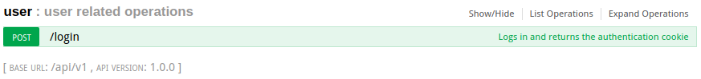
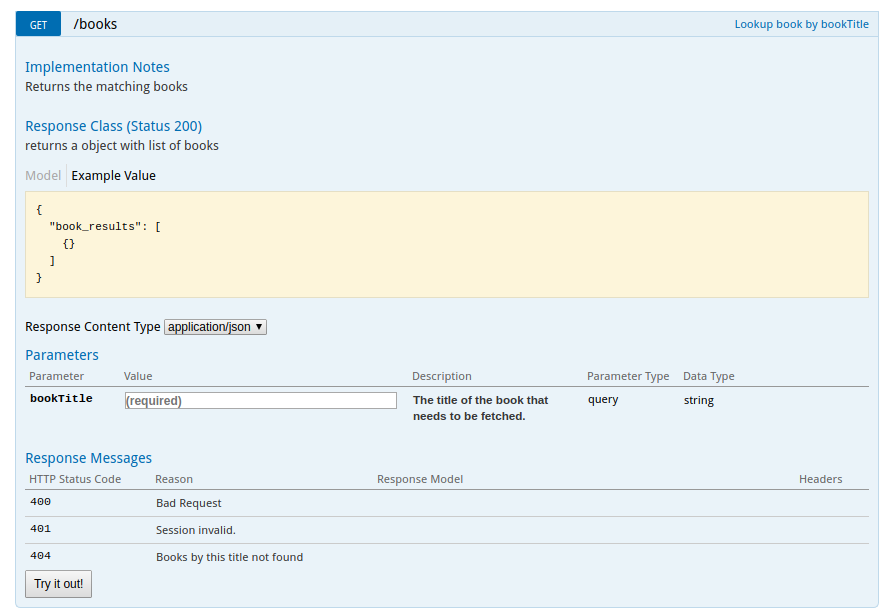
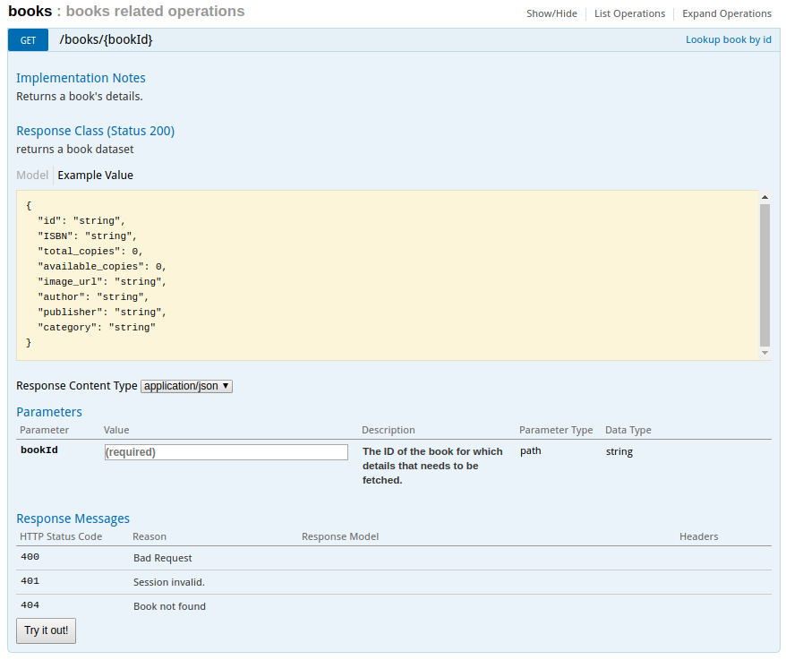
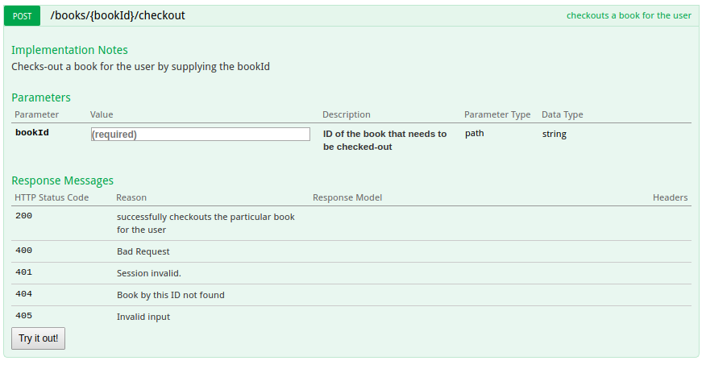
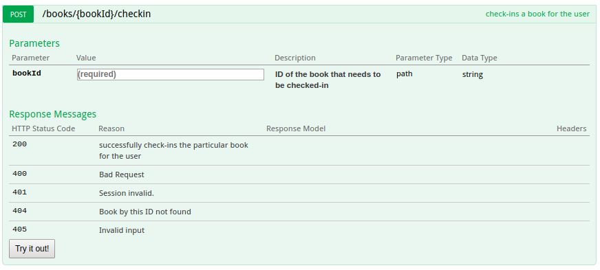
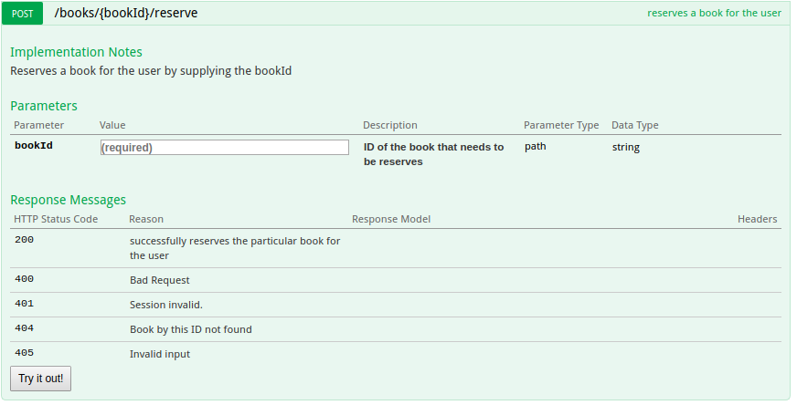
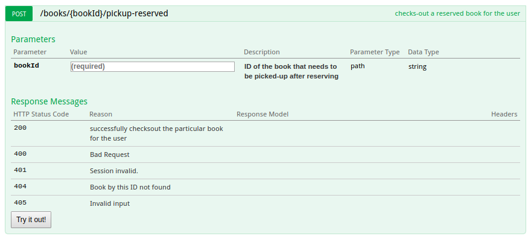
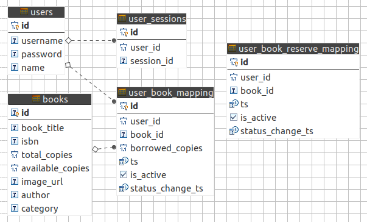

# Automated Library Management System

## Problem Statement
Design an automated librarian service that provides “lookup a book title”, “checkout a book”, “checkin book”, and “reserve book” functionality. Design and implement a REST server supporting these features. Use your past experience at libraries as a guide in the level of details you deem appropriate for this project. Please spend no more than 3 hours on your solution. Include instructions on how to run your project, assumptions you made during the design, and improvements you would like to make if you have more time. For bonus points, create a front-end application for the service.

### REST API Specifaction/Definition















To view the Open API documentation: http://localhost:8080/docs/

## Assumptions
The user is interacting with the kiosk for self-service. The library functions have been automated.

The user is registered with the library and has a library card with unique membership number.

The default return time after a book has been checked-out is 2 weeks.

Reserve functionality is similar to placing-hold. The feature of notifying the user via text/email isn't implemented and is assumed funcitonality.


### Running the server

To run the server and install dependencies, run:
```
npm install

node index.js
```
#### Setting up DB
```
Run the DDL script found under scripts/db_schema.sql 
Add test users by running the scripts/addusers.js
Add books data by running the python script under scripts/books.py
Change the database config in config.json to point to your DB
```
##### DB ER diagram


### Testing
Here is the link to the PostMan collection that you can use for testing the APIs:
https://www.getpostman.com/collections/b1cdf3e3b8c017216d3e